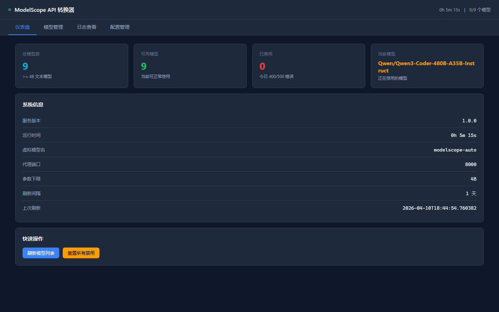
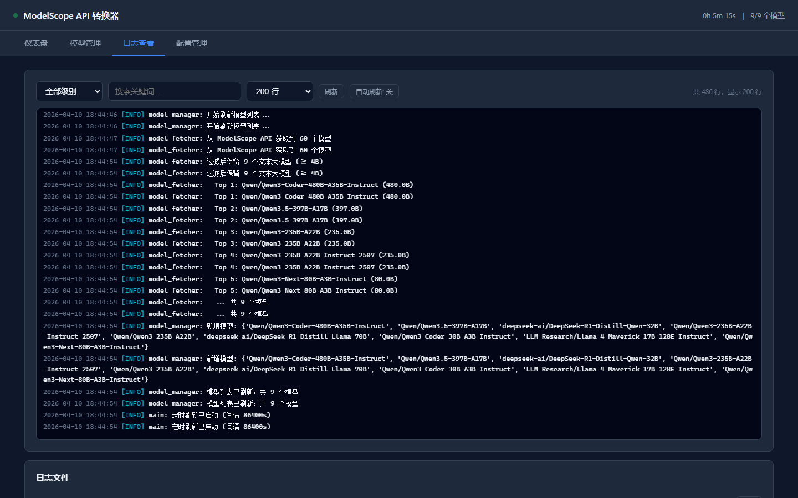
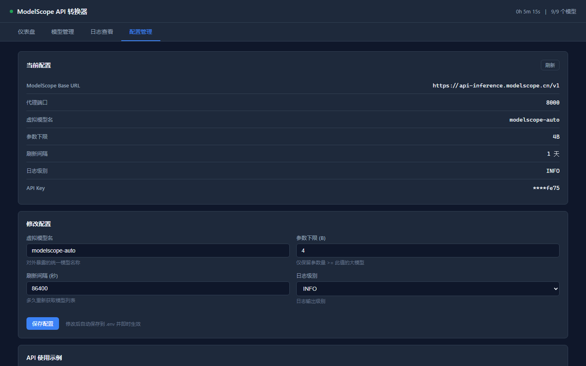

<div align="center">

# ModelScope Auto Proxy

**ModelScope 免费大模型自动代理 | OpenAI 兼容接口 | 零配置接入 Vibe Coding**

[](https://python.org)
[](https://fastapi.tiangolo.com)
[](LICENSE)

[English](#english) | [中文文档](#中文文档)

</div>

---

## 中文文档

### 这是什么？

ModelScope Auto Proxy 是一个轻量级的 API 代理服务，让你用一个虚拟模型名就能自动调用 ModelScope 上所有免费的优质大语言模型。

你只需要一个 ModelScope 免费账号，就能让 Cursor、Cline、Continue 等 AI 编程工具用上 Qwen3-Coder-480B、Qwen3.5-397B 等顶级模型 —— 无需付费，无需自建 GPU。

### 为什么需要它？

ModelScope 提供了大量免费的大模型 API-Inference 服务，但存在几个问题：

- 每个模型有独立的模型 ID，客户端需要指定具体模型
- 部分模型可能临时不可用，需要手动切换
- 需要自己筛选哪些模型适合编程任务

本代理自动解决这些问题：对外暴露单一模型名 `modelscope-auto`，内部自动从可用模型列表中选取最优模型，遇到故障自动切换，全程无感。

### 管理后台预览

<div align="center">

<p><em>仪表盘：模型数量、运行状态、当前模型一目了然</em></p>


<p><em>请求日志：实时查看请求详情，按级别过滤和关键词搜索</em></p>


<p><em>实时配置：在线修改参数，即时生效并持久化</em></p>
</div>

### 核心特性

**智能模型管理**
- 自动获取 ModelScope 支持 API-Inference 的大模型列表
- 按参数量从大到小排序，优先使用最强模型
- 智能过滤：排除视觉/多模态/推理专用/基座模型，只保留适合编码的模型
- 参数下限可配置（默认 4B 以上）

**故障自动切换**
- 遇到 400/500/502/503 错误自动标记并切换下一个模型
- 全部不可用时返回 503，而不是挂起等待
- 每日自动重置禁用状态

**OpenAI 完全兼容**
- 接口格式与 OpenAI API 100% 兼容
- 支持流式响应（SSE）
- 可直接用于 Cursor、Cline、Continue、Aider 等 AI 编程工具

**管理后台**
- 内置 Web 管理界面，访问 `/admin` 即可使用
- 仪表盘：模型数量、运行状态、当前模型一目了然
- 模型管理：手动启用/禁用模型
- 日志查看：实时日志、按级别过滤、关键词搜索、自动刷新
- 配置管理：在线修改参数，即时生效并持久化

### 5 分钟快速开始

```bash
# 1. 克隆项目
git clone https://github.com/comedy1024/modelscope-auto-proxy.git
cd modelscope-auto-proxy

# 2. 安装依赖
pip install -r requirements.txt

# 3. 配置 API Key
cp .env.example .env
# 编辑 .env，填入你的 ModelScope API Key（在 https://www.modelscope.cn/my/myaccesstoken 获取）

# 4. 启动
python main.py
```

服务默认运行在 `http://0.0.0.0:8000`。

### 接入 AI 编程工具

#### Cursor

在 Cursor 设置中添加：

```
API Base URL: http://localhost:8000/v1
API Key: 你的 ModelScope API Key
Model: modelscope-auto
```

#### Cline / Continue / Aider

所有兼容 OpenAI 接口的工具均可使用，只需将 Base URL 指向本服务，模型名填 `modelscope-auto`。

#### curl 测试

```bash
# 非流式
curl http://localhost:8000/v1/chat/completions \
  -H "Content-Type: application/json" \
  -d '{
    "model": "modelscope-auto",
    "messages": [{"role": "user", "content": "写一个 Python 快速排序"}],
    "max_tokens": 1024
  }'

# 流式
curl http://localhost:8000/v1/chat/completions \
  -H "Content-Type: application/json" \
  -d '{
    "model": "modelscope-auto",
    "stream": true,
    "messages": [{"role": "user", "content": "Hello!"}],
    "max_tokens": 512
  }'
```

### 工作原理

```
客户端 (Cursor/Cline/etc.)
    │  model = "modelscope-auto"
    ▼
┌──────────────────────────┐
│   ModelScope Auto Proxy  │
│                          │
│  1. 从可用列表选最强模型  │
│     (Qwen3-Coder-480B)   │
│                          │
│  2. 转发到 ModelScope    │
│     API-Inference         │
│                          │
│  3. 成功 → 返回响应       │
│     失败 → 标记+切换重试  │
│     全挂 → 503            │
└──────────────────────────┘
    │
    ▼
  ModelScope API
```

### API 端点

| 端点 | 方法 | 说明 |
|------|------|------|
| `/v1/chat/completions` | POST | OpenAI 兼容的聊天补全接口 |
| `/v1/models` | GET | 列出所有可用模型 |
| `/v1/status` | GET | 模型管理状态 |
| `/v1/refresh` | POST | 手动触发模型列表刷新 |
| `/admin` | GET | 管理后台页面 |
| `/admin/api/status` | GET | 系统状态 API |
| `/admin/api/models` | GET | 模型列表 API |
| `/admin/api/logs` | GET | 日志查看 API |
| `/admin/api/config` | GET/POST | 配置查看/更新 API |

### 配置项

| 变量 | 默认值 | 说明 |
|------|--------|------|
| `MODELSCOPE_API_KEY` | - | ModelScope API 密钥（必填，需包含 `ms-` 前缀） |
| `PROXY_PORT` | 8000 | 代理服务监听端口 |
| `VIRTUAL_MODEL_NAME` | modelscope-auto | 对外暴露的虚拟模型名称 |
| `MIN_PARAM_B` | 4 | 模型参数量下限（B） |
| `MODEL_REFRESH_INTERVAL` | 86400 | 模型列表刷新间隔（秒） |
| `LOG_LEVEL` | INFO | 日志级别 |

### Docker 部署

```bash
docker build -t modelscope-auto-proxy .
docker run -d \
  -p 8000:8000 \
  -e MODELSCOPE_API_KEY=ms-your_key_here \
  modelscope-auto-proxy
```

### 作为系统服务运行

Linux (systemd):

```ini
# /etc/systemd/system/modelscope-proxy.service
[Unit]
Description=ModelScope Auto Proxy
After=network.target

[Service]
Type=simple
WorkingDirectory=/opt/modelscope-auto-proxy
ExecStart=/opt/modelscope-auto-proxy/venv/bin/python main.py
Restart=always
RestartSec=5

[Install]
WantedBy=multi-user.target
```

```bash
sudo systemctl enable modelscope-proxy
sudo systemctl start modelscope-proxy
```

Windows (nssm):

```bash
nssm install modelscope-proxy "C:\path\to\venv\Scripts\python.exe" "C:\path\to\main.py"
nssm start modelscope-proxy
```

### 注意事项

- 本项目仅供学习和个人使用，请遵守 ModelScope 的服务条款
- ModelScope 的免费 API-Inference 服务有调用频率限制，请合理使用
- 本项目不存储、不转发用户的对话内容到任何第三方服务
- 模型版权归各模型原作者所有，详见各模型在 ModelScope 上的许可协议

---

## English

### What is this?

ModelScope Auto Proxy is a lightweight API proxy that lets you use a single virtual model name to automatically access all available free LLMs on ModelScope's API-Inference platform.

With just a free ModelScope account, you can use top-tier models like Qwen3-Coder-480B and Qwen3.5-397B in Cursor, Cline, Continue, and other AI coding tools — no GPU needed, no payment required.

### Key Features

- **Smart Model Selection**: Automatically picks the best available model, sorted by parameter count
- **Auto Failover**: Switches to the next model on 400/500 errors, with daily auto-reset
- **OpenAI Compatible**: Drop-in replacement for OpenAI API — works with Cursor, Cline, Continue, Aider, etc.
- **Coding-Optimized Filter**: Excludes vision/multimodal/reasoning-only/base models, keeps models suitable for code generation
- **Web Admin Dashboard**: Built-in management UI at `/admin` with real-time logs, model management, and live config editing
- **Streaming Support**: Full SSE streaming response support

### Quick Start

```bash
git clone https://github.com/comedy1024/modelscope-auto-proxy.git
cd modelscope-auto-proxy
pip install -r requirements.txt
cp .env.example .env
# Edit .env with your ModelScope API Key from https://www.modelscope.cn/my/myaccesstoken
python main.py
```

Point your AI coding tool to `http://localhost:8000/v1` with model name `modelscope-auto`.

### Configuration

| Variable | Default | Description |
|----------|---------|-------------|
| `MODELSCOPE_API_KEY` | - | ModelScope API key (required, include `ms-` prefix) |
| `PROXY_PORT` | 8000 | Proxy listen port |
| `VIRTUAL_MODEL_NAME` | modelscope-auto | Virtual model name exposed to clients |
| `MIN_PARAM_B` | 4 | Minimum model parameter count in billions |
| `MODEL_REFRESH_INTERVAL` | 86400 | Model list refresh interval in seconds |
| `LOG_LEVEL` | INFO | Log level |

### Disclaimer

- This project is for educational and personal use only. Please comply with ModelScope's Terms of Service.
- Model copyrights belong to their respective authors. See each model's license on ModelScope.
- This project does not store or forward user conversations to any third party.

## License

[MIT License](LICENSE)
